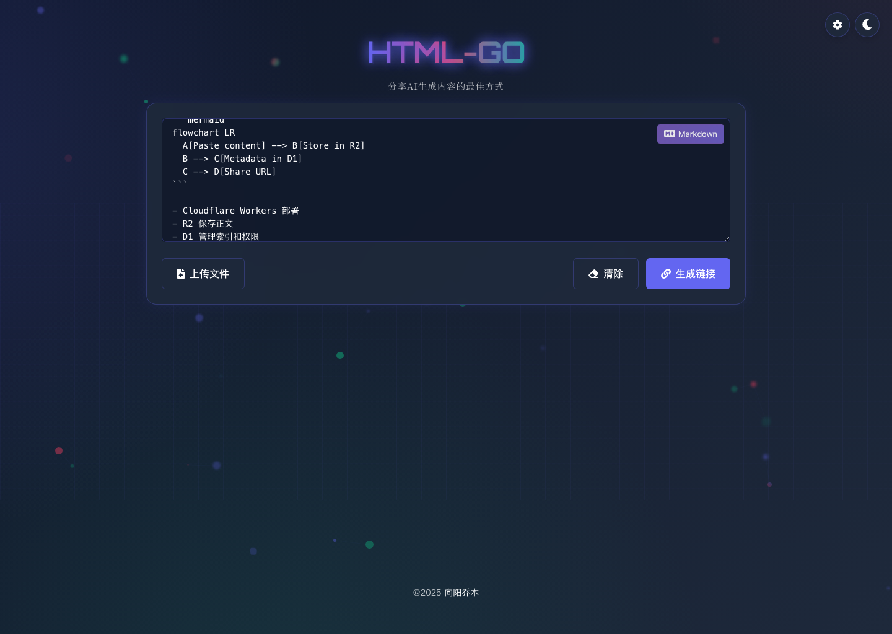
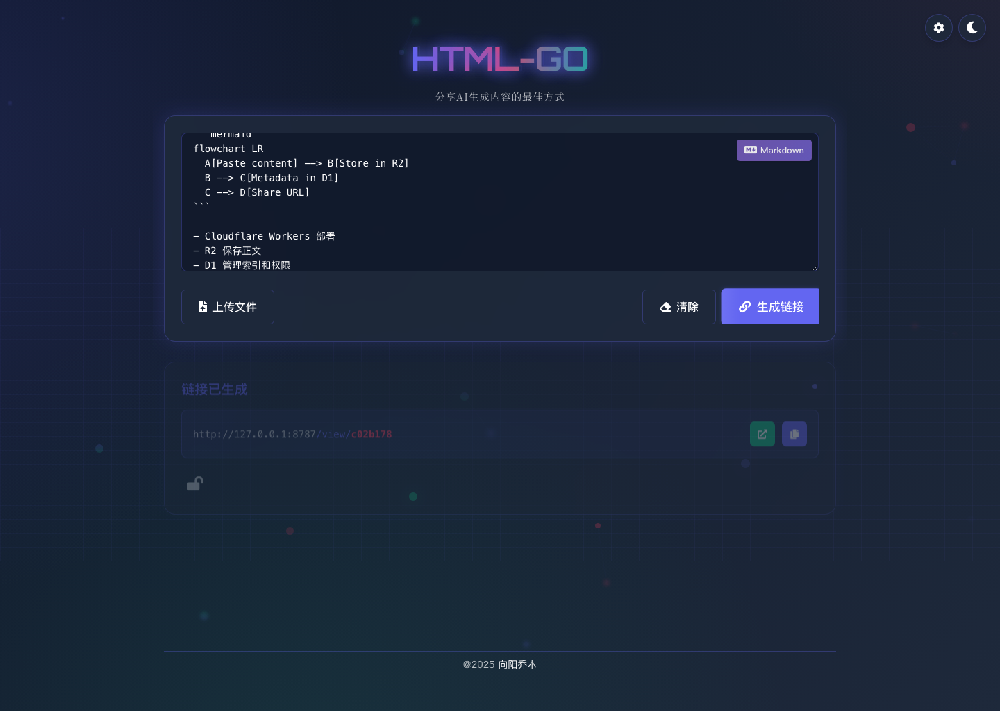
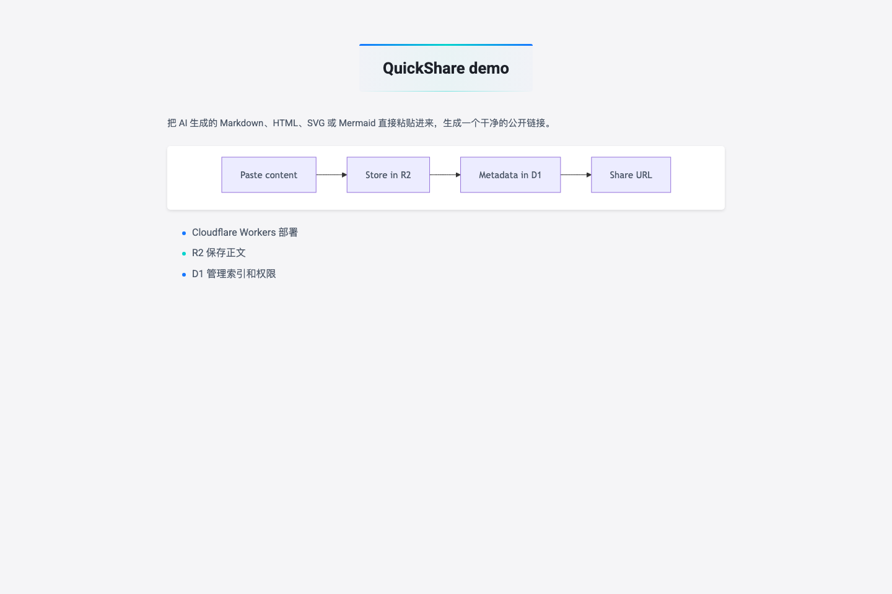
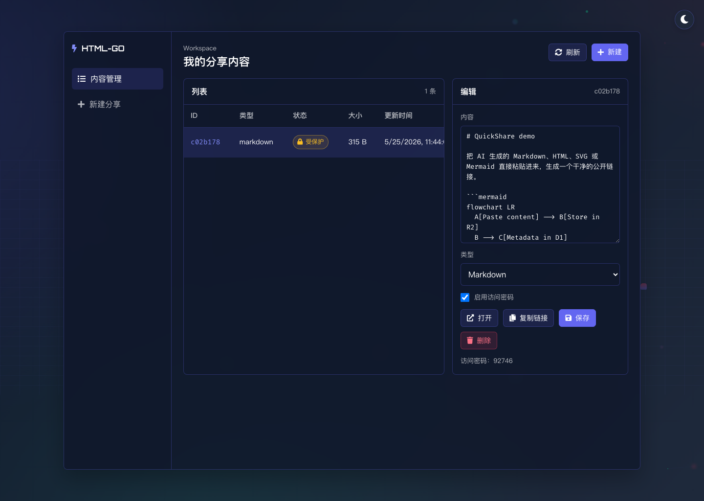
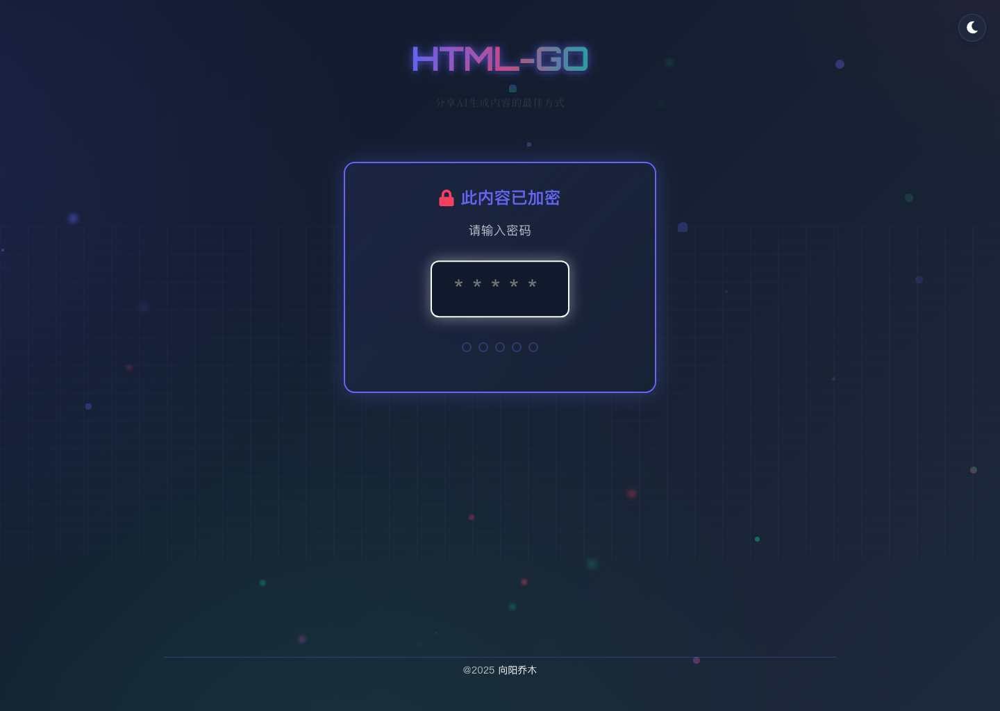
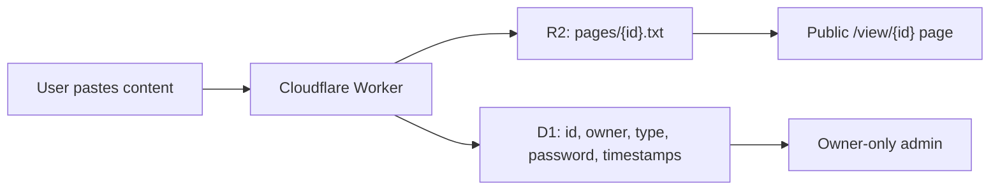

# QuickShare Cloudflare

> 把 AI 生成的 HTML、Markdown、SVG、Mermaid 变成一个干净链接，部署在你自己的 Cloudflare 账号里。
> Paste AI-generated HTML, Markdown, SVG, or Mermaid and share it from your own Cloudflare stack.

[](https://deploy.workers.cloudflare.com/?url=https://github.com/joeseesun/quickshare-cloudflare)
[](https://github.com/joeseesun/quickshare-cloudflare/stargazers)
[](https://github.com/joeseesun/quickshare-cloudflare/forks)
[](https://github.com/joeseesun/quickshare-cloudflare/issues)
[](https://github.com/joeseesun/quickshare-cloudflare/commits/main)
[](#license)



**[中文](#中文) | [English](#english)**

---

<a name="中文"></a>
## 中文

你让 AI 写了一个 HTML Demo、一段 Markdown 文档、一个 SVG 图标或一张 Mermaid 流程图。

发给别人时，最麻烦的不是内容本身，而是怎么让对方不用下载文件、不用登录平台、点开链接就能看。

QuickShare Cloudflare 把这件事压到一个动作：粘贴内容，生成链接。

内容正文进 R2，索引和权限进 D1，页面跑在 Cloudflare Workers。你拥有数据，也拥有部署。



## 为什么值得用

- **专为 AI 生成内容准备**：HTML、Markdown、SVG、Mermaid 都能粘贴，自动识别类型并按合适方式渲染。
- **一键部署到 Cloudflare**：Worker、Static Assets、R2、D1 都走同一个仓库配置，适合 Fork 后快速改成自己的工具。
- **正文不塞数据库**：大段内容放 R2，D1 只保存 ID、时间、类型、密码状态、owner 等元数据。
- **无账号的个人后台**：每个浏览器自动获得 owner cookie，只管理自己创建的内容。
- **可选 5 位数字密码**：适合临时发给朋友、客户、群聊或测试用户，不需要注册系统。
- **可编辑、可删除、可切换保护**：后台能查看列表、编辑正文、复制链接、打开预览、删除过期内容。

## 适合场景

| 你有这些内容 | 用 QuickShare 后 |
| --- | --- |
| AI 生成的 HTML 小页面 | 发一个 `/view/<id>` 链接，对方直接看效果 |
| Markdown 文档或提示词 | 自动渲染成可读页面，不用贴进聊天窗口刷屏 |
| SVG 图标或 Mermaid 图 | 生成可分享预览，方便团队快速确认 |
| 临时内部资料 | 开启 5 位访问密码，降低误传播风险 |

## 功能截图



| 内容管理后台 | 访问密码 |
| --- | --- |
|  |  |

## 一键部署

点击顶部的 **Deploy to Cloudflare** 按钮，Cloudflare 会读取 `wrangler.jsonc`，并在部署流程中绑定：

- D1 数据库：`DB`
- R2 存储桶：`CONTENT_BUCKET`
- Static Assets：`ASSETS`
- Worker 入口：`src/worker.js`

部署命令来自 `package.json`：

```bash
npm run db:migrate:remote && wrangler deploy
```

部署完成后建议立刻在 Cloudflare 控制台里修改变量：

```txt
AUTH_ENABLED=true
AUTH_PASSWORD=<your-strong-password>
COOKIE_SECRET=<openssl rand -hex 32>
```

`AUTH_ENABLED=true` 会保护首页和创建接口；已经生成的分享页仍然可以公开访问，除非你给单条内容开启访问密码。

## 本地开发

### 前置条件

- [ ] 安装 Node.js 20+：`node --version`
- [ ] 安装依赖：`npm install`
- [ ] 登录 Cloudflare CLI：`npx wrangler login`
- [ ] 本地应用 D1 迁移：`npm run db:migrate:local`

### 启动

```bash
npm run dev
```

默认地址通常是 `http://127.0.0.1:8787`，以 Wrangler 输出为准。

### 验证

```bash
npm run check
```

这个命令会执行 `wrangler deploy --dry-run`，用于确认 Worker 配置、模块入口和绑定没有明显问题。

## 手动部署

不使用 Deploy Button 时，可以自己创建资源：

```bash
npx wrangler d1 create quickshare-db
npx wrangler r2 bucket create quickshare-content
```

把 D1 输出里的 `database_id` 写回 `wrangler.jsonc`，然后运行：

```bash
npm run deploy
```

## 刷新 README 截图

先启动本地服务：

```bash
npm run dev
```

再开一个终端运行：

```bash
npm run capture:screenshots
```

如果你的本地服务不是 `8787` 端口：

```bash
SCREENSHOT_URL=http://127.0.0.1:9000 npm run capture:screenshots
```

截图会写入 `docs/assets/`。

## 数据模型



D1 表 `pages` 保存：

- `id`：短链接 ID
- `r2_key`：R2 对象 key
- `created_at` / `updated_at`：创建和更新时间
- `owner_key`：浏览器 owner 身份哈希
- `password` / `is_protected`：访问密码和保护状态
- `code_type`：`html`、`markdown`、`svg`、`mermaid`
- `content_size` / `content_sha256`：正文大小和哈希

R2 对象保存在 `pages/{id}.txt`。

## Fork 后可以改什么

- 换品牌：修改 `APP_NAME`、图标、主题色和 footer。
- 加登录：把 owner cookie 换成 GitHub、Google、邮箱验证码或 Cloudflare Access。
- 加过期时间：给 `pages` 表增加 `expires_at`，在读取和后台列表中过滤。
- 加公开广场：使用 `/api/pages/list/recent` 做最近分享列表。
- 加自定义域名：在 Cloudflare Workers 路由里绑定你的域名。

## Troubleshooting

| 问题 | 解决方法 |
| --- | --- |
| `No such module` 或静态资源 404 | 确认执行过 `npm install`，并通过 `npm run dev` 启动 Wrangler。 |
| D1 本地表不存在 | 运行 `npm run db:migrate:local`，再重启 `npm run dev`。 |
| 部署时报 D1 `database_id` 错误 | 手动部署时需要把 `wrangler d1 create` 输出写回 `wrangler.jsonc`；Deploy Button 流程会自动处理绑定。 |
| 首页任何人都能打开 | 默认 `AUTH_ENABLED=false` 方便体验；生产环境请在 Cloudflare 控制台设置为 `true`。 |
| 清理 Cookie 后后台看不到旧内容 | 后台按浏览器 owner cookie 区分内容。旧分享链接仍可访问，但当前浏览器会失去管理权。 |

## 致谢

- [Cloudflare Workers](https://workers.cloudflare.com/)
- [Cloudflare R2](https://developers.cloudflare.com/r2/)
- [Cloudflare D1](https://developers.cloudflare.com/d1/)
- [marked](https://github.com/markedjs/marked)
- [Playwright](https://playwright.dev/) 用于生成 README 截图

## License

ISC

---

<a name="english"></a>
## English

QuickShare Cloudflare turns AI-generated HTML, Markdown, SVG, and Mermaid into shareable links on your own Cloudflare account.

It stores large content bodies in R2, keeps metadata in D1, and serves everything through Cloudflare Workers.

## Features

- Paste HTML, Markdown, SVG, or Mermaid and get a clean `/view/<id>` URL.
- Optional 5-digit password per shared page.
- R2-backed content storage, D1-backed metadata.
- Owner-cookie based admin without user accounts.
- Admin page for listing, editing, opening, copying, protecting, and deleting your own shares.
- Deploy Button support for fast Cloudflare setup.

## Deploy

[](https://deploy.workers.cloudflare.com/?url=https://github.com/joeseesun/quickshare-cloudflare)

Recommended production variables:

```txt
AUTH_ENABLED=true
AUTH_PASSWORD=<your-strong-password>
COOKIE_SECRET=<openssl rand -hex 32>
```

## Local Development

```bash
npm install
npm run db:migrate:local
npm run dev
```

Run a dry deployment check:

```bash
npm run check
```

Refresh README screenshots:

```bash
npm run capture:screenshots
```

Use another local URL:

```bash
SCREENSHOT_URL=http://127.0.0.1:9000 npm run capture:screenshots
```

## Architecture

- `src/worker.js`: Cloudflare Worker routes and API handlers
- `src/templates.js`: HTML templates for the index, admin, login, password, and error pages
- `src/renderers.js`: content type detection and rendering
- `public/`: static CSS, JS, icons, and assets
- `migrations/`: D1 schema migrations
- `docs/assets/`: README screenshots

## Notes

The admin page is intentionally lightweight. It uses an owner cookie to separate content created by different browsers. If the cookie is cleared, old public links still work, but that browser loses management access for those pages.
